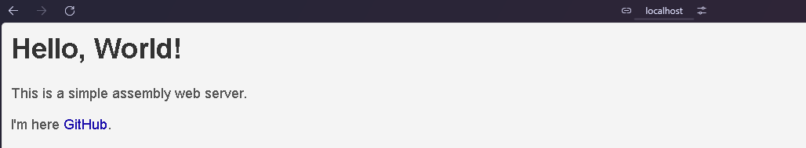
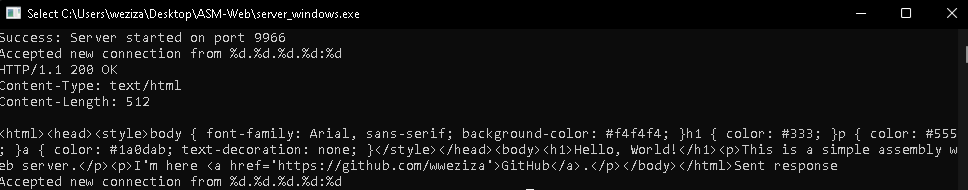
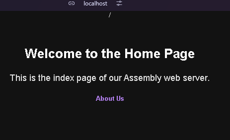
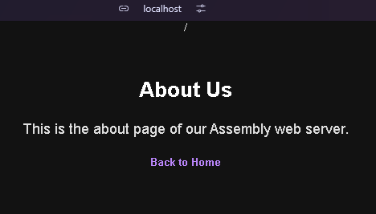

# ASM-HTTP

This repository contains implementations of a simple HTTP server written in assembly language for both Windows and Linux environments. The server listens on port 9966 and responds with a basic HTML page.

Now supported handle the request parsing the request

## Screenshot



### http://localhost:9966/

### http://localhost:9966/about

## Windows Version

### Requirements
- MASM32 SDK

### Compilation and Usage

1. Save the Windows version code to a file named `server_win.asm`.

2. Open the MASM32 command prompt.

3. Navigate to the directory containing `server_win.asm`.

4. Assemble the code:
   ```
   ml /c /coff start.asm
   ml /c /coff pages\index.asm
   ml /c /coff pages\about.asm
   ```

5. Link the object file:
   ```
   link /subsystem:console start.obj index.obj about.obj
   ```

6. Run the server:
   ```
   start.exe
   ```

7. Open a web browser and navigate to `http://localhost:9966` to see the server response.

## Linux Version

### Requirements
- NASM (Netwide Assembler)

### Compilation and Usage

1. Save the Linux version code to a file named `server_linux.asm`.

2. Open a terminal.

3. Navigate to the directory containing `server_linux.asm`.

4. Assemble the code:
   ```
   nasm -f elf32 server_linux.asm
   ```

5. Link the object file:
   ```
   ld -m elf_i386 server_linux.o -o server_linux
   ```

6. Run the server:
   ```
   ./server_linux
   ```

7. Open a web browser and navigate to `http://localhost:9966` to see the server response.

## Notes

- Both versions listen on port 9966 by default. If you need to change the port, modify the `port` value in the respective assembly files.
- The Linux version is compiled for 32-bit systems. If you're on a 64-bit system, you might need to install 32-bit libraries or adapt the code for 64-bit assembly.
- These servers are intended for educational purposes and are not suitable for production environments without further enhancements.

## Testing

You can test the server using curl:

```
curl http://localhost:9966
```

Or by opening `http://localhost:9966` in a web browser.

## Upcoming

- Multiple handle for other files than index.html (Done)
- Port the request handle to linux server


## Contributing

Feel free to fork this repository and submit pull requests with improvements or additional features!

## License

This project is open source and available under the [MIT License](LICENSE).
